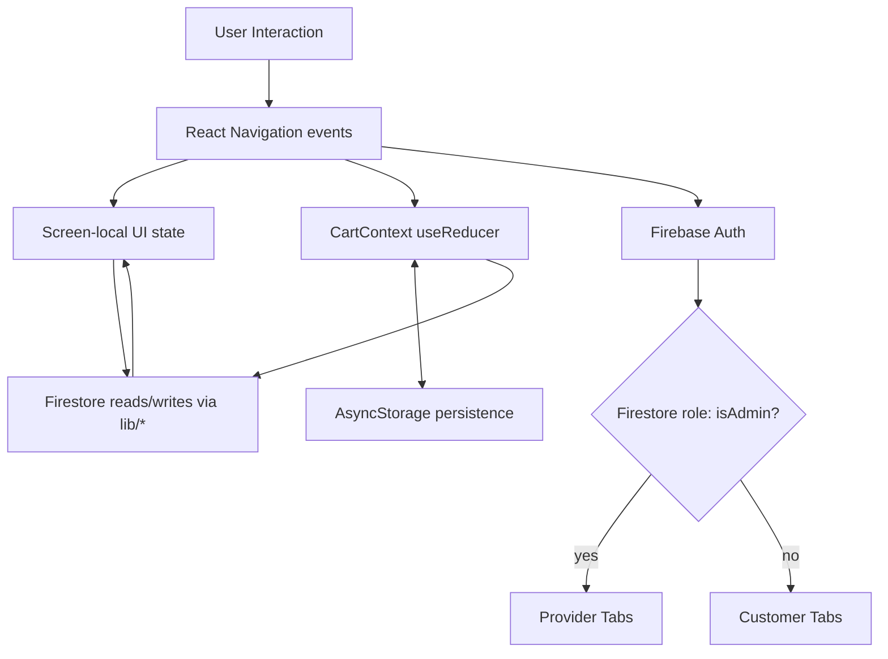
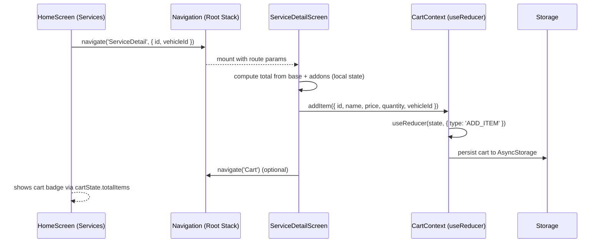

Front-end additional requirements

Customers:
-Cards for when a user clicks on a service cardin the main screen
-Add a cart to the main screen where you preview the services

Admin:
-create view all page for the mission que
-Create screens for all buttons in the profile tab
-Make the chat screens pressable components that take you to a new screen 

Back-end requirements

Customers:
-Must be able to add services to the cart, have the price adjusted based on the vehicle and service type they want, and pay a deposit
	-Create progress bars on the completion of their service
-Direct Messaging
	-Allow documents/pictures to be sent

Admin:
-Store data on earnings, services provided, client index, and total hours
-Have Mission Que updating and the history for mission que
-Direct Messaging
-Profile page setup
 
## State Management

This app combines server-authoritative state (Firebase) with lightweight client-global state (React Context + reducer) and local screen state.

- Auth and role: Firebase Auth persists the session; role (`isAdmin`) is read from Firestore to route users to Customer or Provider shells.
- Cart: `CartContext` uses `useReducer` for deterministic updates and persists to `AsyncStorage` so the cart survives restarts.
- Screen-local state: Forms, filters, and transient UI live in component state for responsiveness.
- Data access: Thin wrappers in `lib/` read/write Firestore (e.g., `lib/profile.ts`, `lib/vehicles.ts`).
- Notifications: On login, we register for push and save the token on the user document for targeted messaging.

Key files:
- `App.tsx`: Providers (Gesture, SafeArea, Stripe, Cart) and `NavigationContainer`.
- `navigation/AppNavigator.tsx`: Auth listener + role-based routing to Customer/Provider shells.
- `contexts/CartContext.tsx`: `useReducer` cart with `AsyncStorage` persistence.
- `lib/*.ts`: Small modules for Firestore reads/writes (profile, vehicles, etc.).

## UI Libraries

- React Navigation: Native stack + bottom tabs for flows and wayfinding.
- Stripe (`@stripe/stripe-react-native`): Payments and checkout primitives.
- Expo modules: `expo-notifications`, `expo-linear-gradient`, `expo-blur`, `expo-status-bar`, etc., to enhance platform UX.
- Icons:
  - `lucide-react-native`: Yes, this is an icon library used for consistent, customizable icons.
  - `@expo/vector-icons`: Available for additional icon sets.

Not used:
- Material UI (MUI) is a web React library; we don’t use it here. There’s no RN equivalent like React Native Paper or NativeBase in dependencies—most UI is custom with React Native primitives plus the libraries above.

## Component Interaction

At a high level, components communicate via React Navigation for flow control, React Context for shared client state, and small lib modules for server I/O. A typical customer journey:

Provider-side interactions are similar: tab surfaces host stacks; deep screens (e.g., RequestDetail, InspectionChecklist) read/write Firestore via `lib/*` modules and signal navigation transitions.

## CartContext and useReducer (Deep Dive)

- Shape:
  - `CartState`: `{ items: CartItem[]; totalItems: number; totalPrice: number; isLoading: boolean }`.
  - `CartItem`: `{ id, name, price, quantity, vehicleId, vehicleDisplay, image }`.
- Lifecycle:
  - On boot, the provider loads from `AsyncStorage('cart')`. If invalid, it clears to a safe initial state.
  - On every state change (after loading), the provider persists back to `AsyncStorage`.
- Actions:
  - `ADD_ITEM`: Upsert by `(id, vehicleId)`; recompute `totalItems` and `totalPrice`.
  - `REMOVE_ITEM`: Filter by `id`; recompute aggregates.
  - `CLEAR_CART`: Reset to initial with `isLoading: false`.
  - `SET_CART` / `SET_LOADING`: Internal bootstrapping.
- Why useReducer: deterministic transitions, easy testing, and centralized logic for derived totals. Context exposes helpers (`addItem`, `removeItem`, `updateItemQuantity`, `clearCart`) so UI never touches reducer internals.
- Usage examples:
  - `ServiceDetailScreen` builds a `CartItem` from selected addons and calls `addItem(item)`.
  - `HomeScreen` reads `cartState.totalItems` to render the header badge and navigates to `Cart`.
  - `CartScreen` calls `removeItem(id)` and `clearCart()`.

## Main Hooks Used and Context

- React core:
  - `useState`, `useEffect`, `useRef`, `useReducer`, `useContext`: Local UI state, side effects, animations, cart reducer, and cart access.
- React Navigation:
  - `useNavigation`, `useRoute`: Navigation between stack/tabs, consuming route params like `serviceId`, `vehicleId`.
- Safe area & gestures:
  - `useSafeAreaInsets`: Adjusts paddings for notches and system UI.
- Firebase Auth:
  - `onAuthStateChanged` (via `useEffect`): Detects session changes; triggers role fetch and routing.
- Expo Notifications:
  - Registration flows are called from `App.tsx` on user login to store tokens; not a hook per se but used inside effects at startup.
- Custom:
  - `useCart` (wrapper around `useContext(CartContext)`): Read cart state and invoke cart actions.
  - `useFrameworkReady`: Utility hook to poke a global callback on mount (used for integration testing/dev tooling).

## Interview Notes (quick talking points)

- Server-auth + Firestore role decide shell; client-global cart is a reducer persisted to storage.
- Navigation separates stable surfaces (tabs) from deep tasks (stacks) to preserve context.
- Notifications and payments are first-class via Expo + Stripe providers.